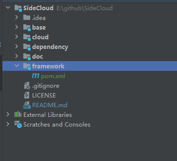

# SideCloud

## 目标说明

SideCloud 是一个基于云的边缘计算平台，旨在为边缘计算设备提供云服务。

## 架构设计

### 目标
#### 1.探索主流技术，使用jdk17, springboot3.3GA、spring-cloud 2023、alibaba-cloud 2023、spring native、Quarkus等主流技术进行开发；
#### 2.支持容器化环境，使用docker、kubernetes等容器技术进行部署；
#### 3.提供大数据分析、AI等功能；
### 组件选型
#### 1.服务注册中心：Nacos、apollo
#### 2.服务网关：Spring Cloud Gateway
#### 3.服务调用：Spring Cloud OpenFeign
#### 4.分布式事务：seata
#### 5.分布式调度：xxlJob
#### 6.消息总线：Spring Cloud Stream
#### 7.数据库：MySQL、postgreSQL、MongoDB
#### 8.缓存：Redis、Memcached
#### 9.orm框架：mybatis-flux、jimmer
#### 9.日志系统：(待定)ELK、Zipkin
#### 10.监控系统：(待定)Prometheus、Grafana
#### 11.AI功能：(待定) TensorFlow、PyTorch、PaddlePaddle

## 主要功能

#### base:服务直接的引入model，提供标准的模板，如web服务模板，是framework的集成
#### cloud:具体service的入口
#### dependency:依赖管理，提供统一的依赖管理，如maven、gradle
#### doc:文档模块，提供详细的文档说明，包括使用说明、开发指南、部署指南等
#### framework：框架模块，提供各个核心概念的处理
#### plugin:插件模块，提供插件机制，如自定义插件、扩展插件等（待定）

## 模块说明

## 开发计划

